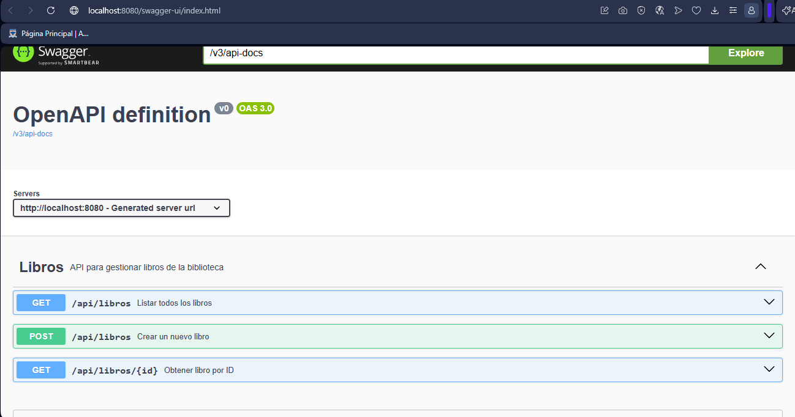
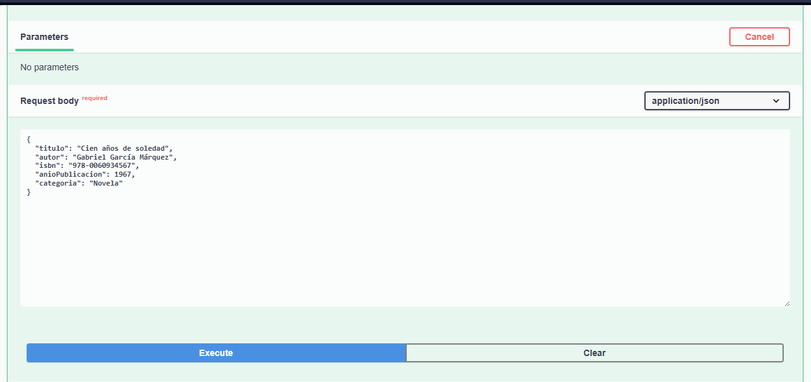
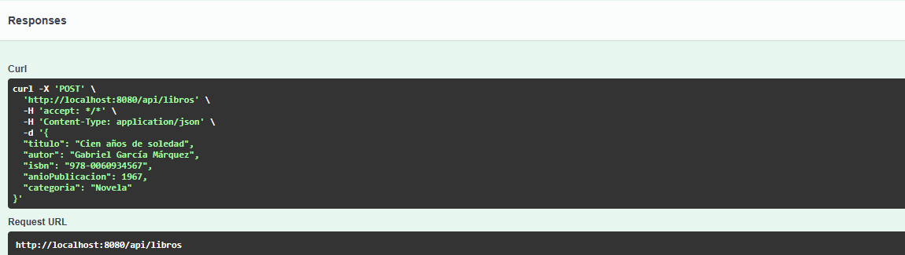
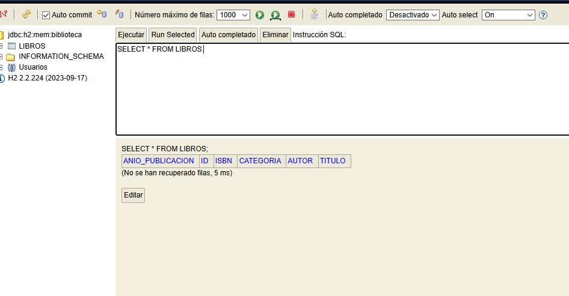

# Sistema de Biblioteca - Spring Data JPA y H2

Este proyecto es una aplicación RESTful desarrollada con Spring Boot que implementa persistencia de datos utilizando Spring Data JPA y una base de datos H2 en memoria.

## Características del Proyecto

- **Entidad**: `Libro` con campos: id, titulo, autor, isbn, anioPublicacion, categoria
- **Repositorio**: `LibroRepository` extiende `JpaRepository`
- **DTOs**: `LibroRequestDTO` y `LibroResponseDTO` para transferencia de datos
- **Mapper**: `LibroMapper` para convertir entre entidad y DTOs
- **Servicio**: `LibroService` con métodos para guardar, buscar por ID y listar todos
- **Controlador**: `LibroController` con endpoints GET y POST
- **Documentación**: Swagger/OpenAPI integrado
- **Excepciones**: `GlobalExceptionHandler` para manejo de errores

## Tecnologías Utilizadas

- Java 17
- Spring Boot 3.2.0
- Spring Data JPA
- H2 Database (en memoria)
- Lombok
- SpringDoc OpenAPI
- Jakarta Validation

## Estructura del Proyecto

```
src/
├── main/
│   ├── java/
│   │   └── com/
│   │       └── biblioteca/
│   │           ├── BibliotecaApplication.java
│   │           ├── controller/
│   │           │   └── LibroController.java
│   │           ├── dto/
│   │           │   ├── LibroRequestDTO.java
│   │           │   └── LibroResponseDTO.java
│   │           ├── exception/
│   │           │   └── GlobalExceptionHandler.java
│   │           ├── mapper/
│   │           │   └── LibroMapper.java
│   │           ├── model/
│   │           │   └── Libro.java
│   │           ├── repository/
│   │           │   └── LibroRepository.java
│   │           └── service/
│   │               └── LibroService.java
│   └── resources/
│       └── application.properties
```

## Endpoints de la API

| Método | Endpoint | Descripción |
|--------|----------|-------------|
| POST | `/api/libros` | Crear un nuevo libro |
| GET | `/api/libros/{id}` | Obtener un libro por ID |
| GET | `/api/libros` | Listar todos los libros |

## Cómo Ejecutar

1. Asegúrate de tener Java 21 y Maven instalados
2. Ejecuta el proyecto:
   ```bash
   mvn spring-boot:run
   ```
3. Accede a Swagger UI: http://localhost:8080/swagger-ui.html
4. Accede a la consola H2: http://localhost:8080/h2-console
   - JDBC URL: `jdbc:h2:mem:biblioteca`
   - Username: `sa`
   - Password: (vacío)

=======
## Capturas de Pantalla

### Swagger UI - Lista de Endpoints


### Swagger UI - Crear Libro


### Swagger UI - Respuesta de Libro Creado






>>>>>>> 9018277 (Actualizar README con capturas y detalles finales)

## Autor

[esteban mauricio calderon bayona 02220132006]

## Licencia
## Capturas de Pantalla

### Swagger UI - Lista de Endpoints


### Swagger UI - Crear Libro


### Swagger UI - Respuesta de Libro Creado


### Consola H2 - Tabla de Libros


## Autor

[esteban mauricio calderon bayona 02220132006]

MIT
=======
>>>>>>> 9018277 (Actualizar README con capturas y detalles finales)
